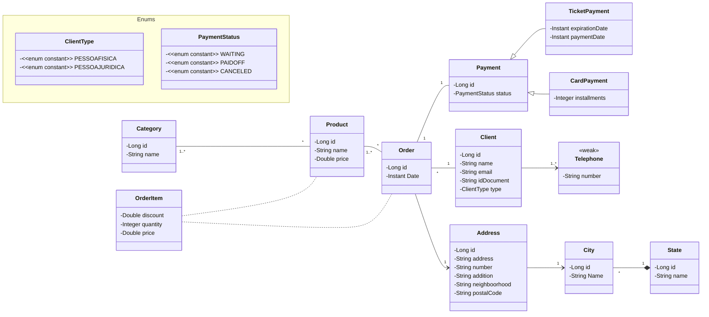

# Projeto Modelagem de dados UML, Spring Boot e JPA/Hibernate

## Objetivo

Estudo de caso de como um modelo conceitual pode ser implementado sobre o paradigma orientado à objetos.

## Tecnologias

    

## Modelo Conceitual

## Endpoints de teste da API

**Categorias:**
    `GET /categories` Lista todas as categorias de produto.
    `GET /categories/{id}` Lista a categoria pelo id informado.
**Clientes:**
    `GET /clients` Lista todos os clientes.
    `GET /clients/{id}` Lista o cliente pelo id informado.
**Pedidos:**
    `GET /orders` Lista todos os pedidos.
    `GET /orders/{id}` Lista o pedido pelo id informado.
